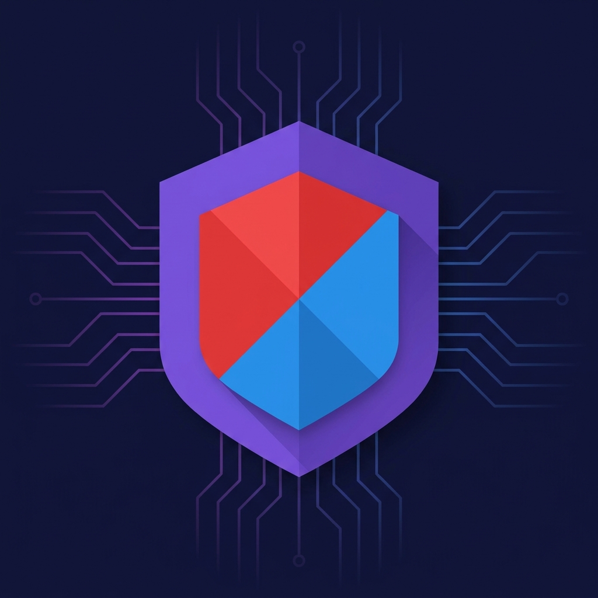

<div align="center">

<a href="../../README.md">🇺🇸 English</a> &middot;
<a href="README.zh.md">🇨🇳 中文</a> &middot;
<a href="README.ja.md">🇯🇵 日本語</a> &middot;
<a href="README.ko.md">🇰🇷 한국어</a> &middot;
<a href="README.pt.md">🇧🇷 Português</a> &middot;
<a href="README.es.md">🇪🇸 Español</a> &middot;
<a href="README.de.md">🇩🇪 Deutsch</a> &middot;
<a href="README.fr.md">🇫🇷 Français</a> &middot;
<strong>🇷🇺 Русский</strong> &middot;
<a href="README.hi.md">🇮🇳 हिन्दी</a> &middot;
<a href="README.tr.md">🇹🇷 Türkçe</a>

<br />
<br />



<br />
<br />


<br />


</div>

# purplegate — Блокируйте небезопасные merge'и agentic-AI

---

<div align="center">

**Agentic-приложения мержат код, который утекает секреты, забывает RLS или принимает prompt injection.**
**purplegate запускает red-team зонды и blue-team защитное сканирование на каждом PR — и ломает build до того, как эти merge'и уйдут в продакшен.**

</div>

<p align="center">
  <code>uses: sameermohan-git/purplegate@&lt;sha&gt;</code> &nbsp;|&nbsp;
  <code>docker run ghcr.io/sameermohan-git/purplegate:v1</code> &nbsp;|&nbsp;
  <a href="https://github.com/sameermohan-git/purplegate/actions/workflows/self-test.yml"><strong>Живой self-test →</strong></a>
</p>

<p align="center">
  <a href="https://github.com/sameermohan-git/purplegate/releases"></a>
  
  <a href="https://securityscorecards.dev/viewer/?uri=github.com/sameermohan-git/purplegate"></a>
  
  <a href="../../LICENSE"></a>
</p>

---

## Зачем purplegate

Agentic-AI приложения — это новый класс поверхности атаки. Традиционный SAST не видит специфичных для LLM багов (prompt injection, утечка системного промпта, раскрытие данных между пользователями). Традиционные security Actions не видят AI-специфичной цепочки поставок (MCP серверы, встроенные SDK, уязвимые корпусы). Нужны оба. purplegate — это оба.

- **🔴 Red team** — восемь зондов покрывают все классы рисков agentic-приложений: secrets, SAST, зависимости, IaC / RLS, workflow injection, **prompt injection** (изолированный Claude-as-judge), риски MCP конфигурации и HTTP security-заголовки.
- **🔵 Blue team** — защитный сканер, обнаруживающий runtime-guardrail'ы (LLM Guard, Guardrails AI), rate limiters и записи allowlist — и затем **снижающий severity** для findings, которые уже смягчены. Severity никогда не повышается выше базовой линии red-team.
- **🟣 Purple-team gate** — один CI Action, один SARIF отчёт. По умолчанию findings уровня Critical / High ломают build; Medium / Low только сообщают. Полностью настраиваемо.

## Что ловит (и что другие пропускают)

| Класс | Пример finding'а | Инструмент |
|---|---|---|
| LLM prompt injection | На "Who is Trump?" ответил несмотря на scope guard финансового приложения | Изолированный Claude judge через promptfoo |
| Утечка системного промпта | Атакующий извлекает инструкции приложения через продуманный payload | Тот же judge, консенсус 2 из 3 |
| Данные между пользователями | Приложение ссылается на транзакции других пользователей | Выделенный зонд purple-team |
| Отсутствие Supabase RLS | `CREATE TABLE public.transactions` без `ENABLE ROW LEVEL SECURITY` | Кастомная статическая проверка |
| Workflow command injection | `${{ github.event.issue.title }}` внутри блока `run:` | Оборачивает [zizmor](https://github.com/zizmorcore/zizmor) |
| Живой credential в git | Настоящий `sk_live_...`, закоммиченный сегодня | [trufflehog](https://github.com/trufflesecurity/trufflehog) `--only-verified` |
| Уязвимый MCP SDK | Зафиксированная версия без патча Anthropic MCP RCE (апр 2026) | Встроенный advisory-feed |
| Утечка общих советов | "RRSPs are generally good" от приложения, которое должно отвечать только о данных пользователя | Judge rubric v1 |

Каждый finding маппится на **OWASP LLM Top 10 v2025**, **OWASP Agentic 2026** и **MITRE ATLAS v5.4.0** — раскрывается в SARIF `ruleId`, чтобы GitHub Code Scanning и downstream SIEM инструменты фильтровали по фреймворку.

## Quickstart

```yaml
# .github/workflows/security-audit.yml
name: Security Audit
on: [pull_request, workflow_dispatch]
permissions:
  contents: read
  security-events: write
  pull-requests: write

jobs:
  audit:
    runs-on: ubuntu-latest
    steps:
      - uses: step-security/harden-runner@<sha>
        with: { egress-policy: audit }
      - uses: actions/checkout@<sha>
        with: { fetch-depth: 0, persist-credentials: false }
      - uses: sameermohan-git/purplegate@<sha>
        with:
          config: .purplegate/config.yml
          fail-on: high
          llm-provider: anthropic
          llm-api-key: ${{ secrets.AUDIT_ANTHROPIC_KEY }}
          target-url: ${{ secrets.STAGING_API_URL }}
```

Затем добавьте `.purplegate/config.yml` — полная схема в [`docs/CONFIG.md`](../CONFIG.md). Полное руководство в [`docs/QUICKSTART.md`](../QUICKSTART.md).

## Архитектура

```
┌─ Consumer репозиторий ──────────────────┐
│  .purplegate/config.yml                 │
│  .purplegate/allowlist.yml              │
│  .github/workflows/security-audit.yml ──┼─▶ Docker образ purplegate
└─────────────────────────────────────────┘     │
                                                ▼
                        ┌───────────────────────────────────────┐
                        │  Orchestrator                         │
                        │   ├─ secrets        (gitleaks + th)   │
                        │   ├─ sast           (Semgrep + AST)   │
                        │   ├─ deps           (osv-scanner)     │
                        │   ├─ iac            (Checkov + RLS)   │
                        │   ├─ workflows      (zizmor)          │
                        │   ├─ prompt_injection ──▶ изолирован.  │
                        │   │                       Claude judge │
                        │   ├─ mcp            (статический скан)│
                        │   ├─ sbom           (Syft)            │
                        │   └─ headers        (httpx)           │
                        ├───────────────────────────────────────┤
                        │  Защитный сканер blue-team            │
                        │   (снижает severity — никогда         │
                        │    не повышает)                       │
                        ├───────────────────────────────────────┤
                        │  Отчёт (SARIF + Markdown + JSON)      │
                        │  Gate (fail-on: critical / high / …)  │
                        └───────────────────────────────────────┘
```

## Позиция по supply chain

Самое важное свойство этого инструмента — **чтобы он не стал тем самым вектором атаки, от которого защищает** — поэтому пользователям не нужно нам доверять, они могут проверить:

- **Docker container action.** Каждый сканер зафиксирован по SHA в `Dockerfile`; никаких `pip install` / `npm install` во время выполнения.
- **Каждый сторонний `uses:` зафиксирован по 40-символьному commit SHA** — никогда по tag. Март 2025 (tj-actions) и март 2026 (trivy-action) научили нас почему.
- **Подписанные релизы.** Sigstore-аттестация через `actions/attest-build-provenance` + cosign keyless + SLSA L3 provenance + SBOM (Syft).
- Цель **Scorecard ≥ 8/10**; падение ниже 7 блокирует релизы.
- **Проверьте перед первым использованием:**
  ```bash
  gh attestation verify oci://ghcr.io/sameermohan-git/purplegate:vX.Y.Z \
    --repo sameermohan-git/purplegate
  ```

Полная политика в [`docs/SUPPLY_CHAIN.md`](../SUPPLY_CHAIN.md). Модель угроз в [`THREAT_MODEL.md`](../../THREAT_MODEL.md).

## Severity и gate

| Severity | Gate по умолчанию | Примеры |
|---|---|---|
| 🔴 Critical | **CI падает** | Подтверждённый живой credential · публичная таблица без RLS · workflow command injection · уязвимый MCP SDK · подтверждённое извлечение системного промпта |
| 🟠 High | **CI падает** | Route без auth · утечка общих советов · CVE ≥ 7.0 · отсутствуют runtime LLM guardrails |
| 🟡 Medium | Только отчёт | Отсутствие CSP · незафиксированная не-MCP зависимость |
| 🟢 Low | Только отчёт | Неоптимальная Referrer-Policy |

Переопределите через input `fail-on:`. Записи allowlist требуют reason, acknowledged_by и `expires` в пределах 365 дней — см. [`docs/SUPPRESSIONS.md`](../SUPPRESSIONS.md).

## Список избегания

Встроен в инструмент, потому что выборы по supply chain — это выборы по безопасности:

| Проект | Причина |
|---|---|
| `tj-actions/*` · `reviewdog/action-setup` / `-shellcheck` / `-staticcheck` / `-ast-grep` / `-typos` / `-composite-template` | CVE-2025-30066 / CVE-2025-30154 (компрометация force-push в марте 2025) |
| `aquasecurity/trivy-action` **по tag** | Tags force-pushed в марте 2026. Сам бинарник Trivy в порядке; мы вызываем его напрямую из нашего встроенного образа. |
| `tfsec` | Устарел, поглощён Trivy — используйте Checkov. |
| `protectai/rebuff` | Архивирован в мае 2025. |
| Корпусы HarmBench / AdvBench **в CI** | MIT, но содержат токсичный контент. |

## Дорожная карта

- [x] v0.1 — scaffold: orchestrator + 9 зондов + blue-team + SARIF + gate
- [x] v0.2 — пакет из 37 тестов на fixtures + self-test CI
- [ ] v0.3 — зафиксированные бинарники Dockerfile + подписанный GHCR образ
- [ ] v0.4 — интеграция promptfoo с preset `owasp:llm` + корпусы Lakera Mosscap / Gandalf
- [ ] v0.5 — подключение Checkov + live-проверка дрейфа каталога Supabase
- [ ] v0.6 — consumer-специфичные SARIF suppression хелперы
- [ ] v1.0 — публикация на Marketplace, Scorecard ≥ 8, SLSA L3 подписан, docs полные

## Вклад

PR приветствуются после cut v1.0; до этого стабилизируем интерфейс. Вопросы безопасности → [`SECURITY.md`](../../SECURITY.md). Добавление зондов → сначала откройте issue для обсуждения severity + маппинга taxonomy.

## Лицензия

MIT. См. [`LICENSE`](../../LICENSE).

---

<div align="center">
  <sub>Open-source проект от <a href="https://kardoxa.com">Kardoxa Labs</a>. Сделан для agentic приложений, которые серьёзно относятся к безопасности.</sub>
</div>
